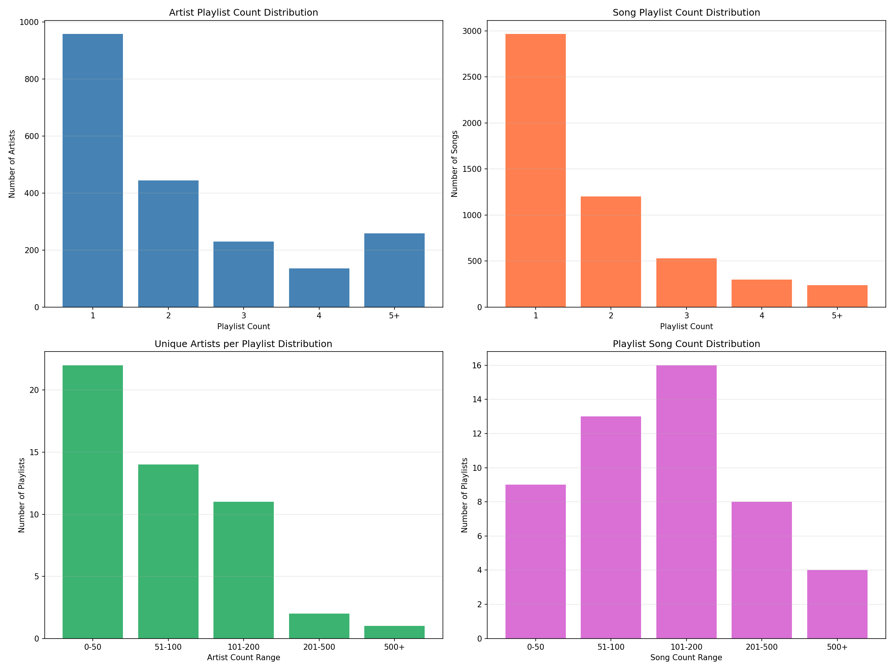
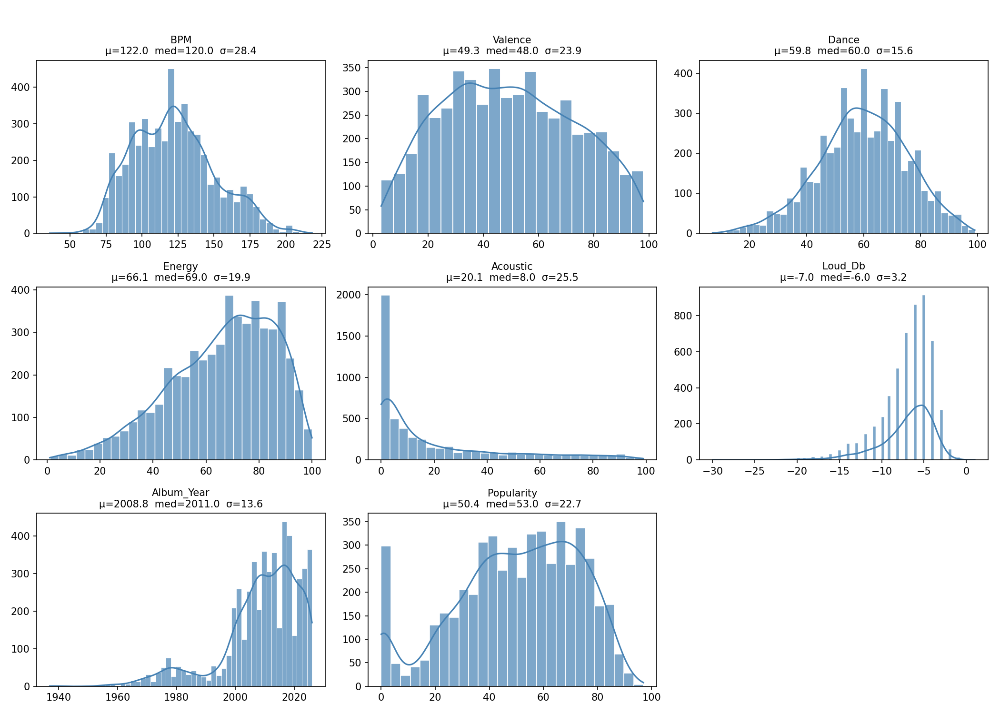
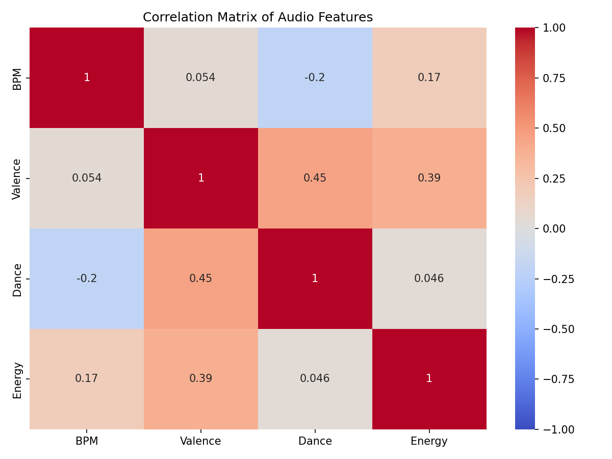
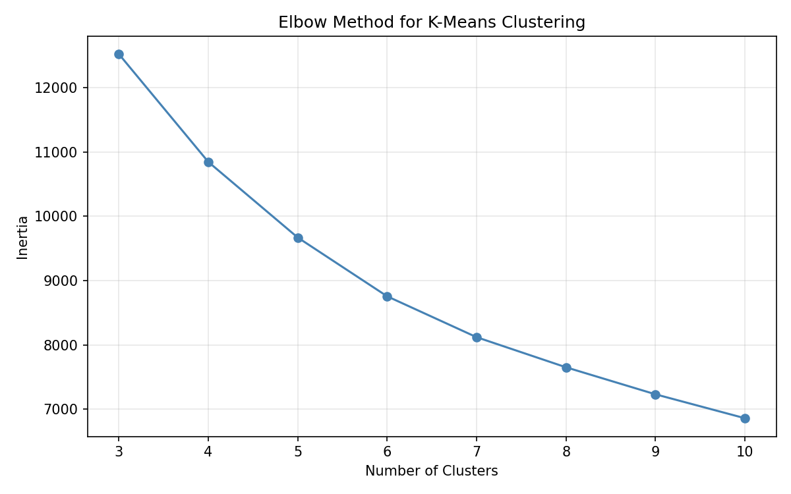
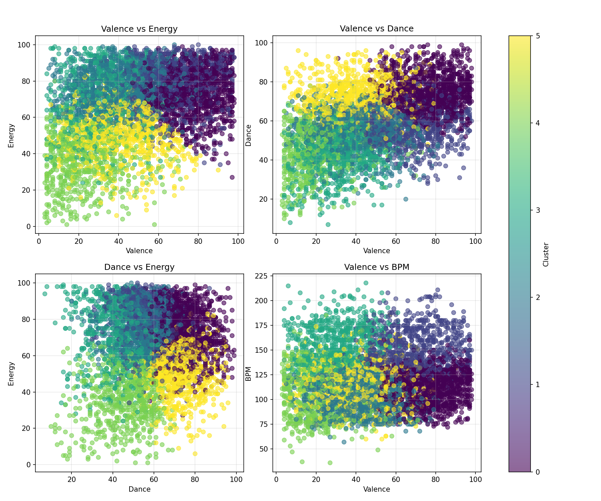
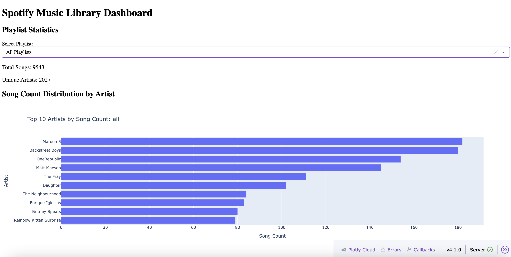
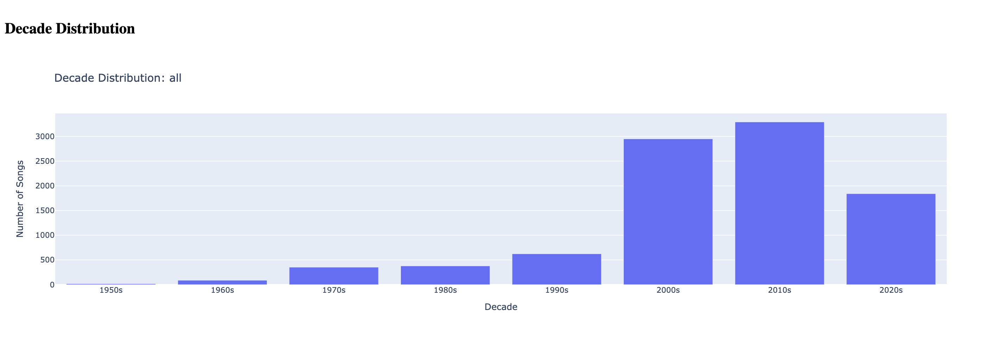
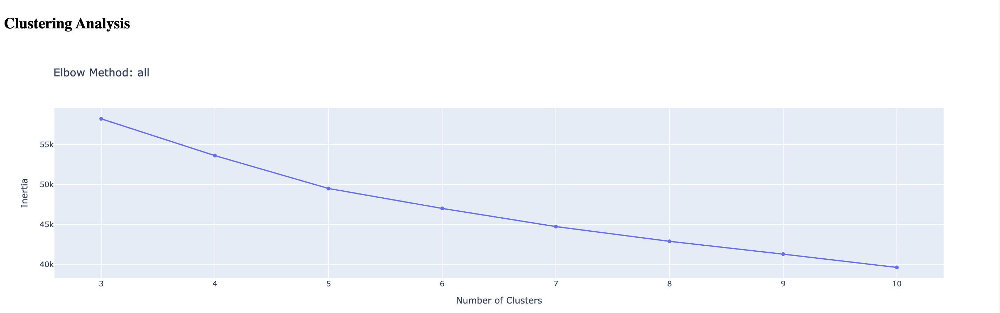
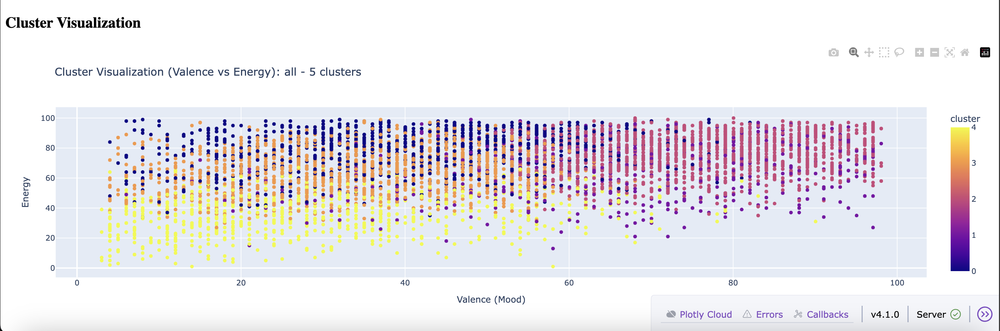

# spotify-music-library
A Spotify-powered music recommendation system using clustering analysis and automated playlist generation to help discover new music and avoid repetition.

## Overview

This project ingests 50 Spotify playlists into a SQLite database, deduplicates 
tracks across playlists, and analyzes audio features (BPM, valence, energy, 
acousticness, etc.) to cluster ~5,000 songs by mood and sonic profile. The 
clustering is the foundation for an automated playlist generator that creates 
new mood-coherent playlists from the library — the goal is discovery without 
repetition across the 50 existing playlists.

**Stack:** Python, SQLite, pandas, scikit-learn, Plotly Dash, matplotlib/seaborn.

**Key design decisions:**
- Tracks deduplicated by composite Track_Key (artist + song) to handle 
  Spotify's multiple Track_IDs for the same song
- Valence weighted 1.5x in clustering to prioritize mood coherence — prevents 
  sad and happy songs from grouping by shared energy/tempo
- Speechiness, Liveness, and Time Signature dropped from features due to 
  low variance

## Project Structure

```
.
├── README.md
├── data/
├── images/
├── requirements.txt
├── spotify_music_library.db
└── src/
    ├── analysis/
    │   ├── dashboard.py
    │   ├── feature_analysis.py
    │   ├── sample_queries.py
    │   └── visualize_distributions.py
    └── db/
        ├── create_artist_playlist_count.py
        ├── create_playlists.py
        ├── create_song_playlist_count.py
        ├── create_tracks.py
        └── setup_database.py
```

## Database Setup

The `src/db/create_playlists.py` script ingests CSV files from 50 Spotify playlists into a SQLite database. The script:

- Reads all CSV files from the `data/` folder
- Extracts playlist number and name from filenames (format: `number_name.csv`)
- Adds metadata columns: `playlist_number`, `playlist_name`, `Album_Year`, and `Track_Key`
- Renames columns for SQL compatibility: `#` → `Song_Number`, `Spotify Track Id` → `Track_ID`
- Appends all data to a `playlists` table in `spotify_music_library.db`

### Setup Commands

```bash
# Create virtual environment
python -m venv .venv
source .venv/bin/activate

# Install dependencies
pip install -r requirements.txt
```

### Database Setup

Run the `src/db/setup_database.py` script to run all database setup steps in sequence:

```bash
python src/db/setup_database.py
```

This will:
1. Create the playlists table from CSV files
2. Deduplicate tracks and create the tracks table
3. Create the song playlist count table
4. Create the artist playlist count table

If you've added new CSV files to the `data/` folder, remove the existing database first:

```bash
rm spotify_music_library.db
```

**Output:**
```
=== Spotify Music Library Database Setup ===


--- Create playlists table from CSV files ---
Running create_playlists.py...
Database created: spotify_music_library.db
Playlists table created successfully.
Number of playlists: 50
Row count: 9543
✓ create_playlists.py completed successfully

--- Deduplicate tracks and create tracks table ---
Running create_tracks.py...
Unique Track_IDs: 5757
Unique Track_Keys: 5231
Unique Artists: 2027
Removed: 526 duplicate tracks (same song, different Track_ID)
Tracks table created with unique tracks sorted by Artist, Song.
✓ create_tracks.py completed successfully

--- Create song playlist count table ---
Running create_song_playlist_count.py...
Total unique songs: 5231
Songs in multiple playlists: 2265
Maximum playlists per song: 11
Song playlist count table created successfully.
✓ create_song_playlist_count.py completed successfully

--- Create artist playlist count table ---
Running create_artist_playlist_count.py...
Total unique artists: 2027
Artists in multiple playlists: 1069
Maximum playlists per artist: 18
Artist playlist count table created successfully.
✓ create_artist_playlist_count.py completed successfully

=== Database Setup Complete ===
All database tables have been created successfully.
```

### Sample Queries

You can run all sample queries at once using the `src/analysis/sample_queries.py` script:

```bash
python src/analysis/sample_queries.py
```

**Get number of unique playlists:**
50

**Get number of unique artists:**
2027

**Get number of unique songs:**
5231

**Get top five artists with song count:**
```
Backstreet Boys|107
OneRepublic|88
Maroon 5|70
Matt Maeson|64
Daughter|58
```

**Get top 5 songs by playlist count:**
```
Kenny Loggins - Danger Zone - From  Top Gun  Original Soundtrack: 11 playlists
The Fray - Singing Low: 10 playlists
50 Cent,Justin Timberlake,Timbaland - Ayo Technology: 8 playlists
Arctic Monkeys - Do I Wanna Know?: 8 playlists
Blue Foundation - Eyes on Fire: 8 playlists
```

**Get top 5 artists by playlist count:**
```
Rainbow Kitten Surprise: 18 playlists
Britney Spears: 18 playlists
OneRepublic: 17 playlists
Matt Maeson: 17 playlists
The Fray: 16 playlists
```

**Get songs from playlist 01:**
```
1|Temporary Love|The Brinks|2015
2|Basic Instinct|The Acid|2014
3|Stressed Out|Twenty One Pilots|2015
4|Genghis Khan|Miike Snow|2015
5|Carl Sagan|Night Moves|2016
6|Ophelia|The Lumineers|2016
7|Nobody Dies|Thao & The Get Down Stay Down|2015
8|Little Numbers - Acoustic Version|BOY|2013
9|I'm a Mess|Ed Sheeran|2014
10|Devil Devil|MILCK|2016
11|Cliff|Låpsley|2016
12|Middle|DJ Snake,Bipolar Sunshine|2015
```

## Analysis

### Data Distribution

The `src/analysis/visualize_distributions.py` script generates charts to analyze the library's composition and identify patterns:

- **Artist Distribution:** 47.3% of artists appear in only one playlist, suggesting a wide artist range across the library rather than repeated reuse.
- **Track Distribution:** 56.7% of songs are unique to a single playlist, indicating that playlists tend to function as distinct collections rather than overlapping selections.
- **Playlist Composition:**
  - Artist density: 44% of playlists contain fewer than 50 unique artists, while 6% of playlists contain more than 200 unique artists.
  - Track volume: 18% of playlists have fewer than 50 songs and 8% of playlists exceed 500 tracks; the majority vary in size, between 50-500 songs.

**Run script:**
```bash
python src/analysis/visualize_distributions.py
```

**Output:**


- Prints statistics for artist and song playlist count distributions

### Feature Analysis

The `src/analysis/feature_analysis.py` script analyzes audio features from the tracks table and generates visualizations:

- **Feature Statistics**: Displays mean, standard deviation, min, max, and quartiles for audio features (BPM, Valence, Dance, Energy, Acoustic, Loudness, Album Year, Popularity).
- **Feature Distributions**: Plots histogram + KDE for each feature showing the distribution and summary statistics.
- **Correlation Matrix**: Shows the correlation between audio features as a heatmap to identify relationships.

Note: Speechiness, Liveness, and Time Signature were excluded due to low variance and limited discriminative value across the library.

**Run script:**
```bash
python src/analysis/feature_analysis.py
```

**Output:**




**Feature Insights:**

- **Energy vs. Loudness**: Despite their 0.73 correlation, both features are retained. Energy is perceptual; Loudness (dB) is physical amplitude. They diverge on fast acoustic passages (high energy, low loudness) and sustained drones (low energy, high loudness), and keeping both intentionally up-weights intensity — a primary axis of separation in the library.
- **Acousticness**: Acousticness correlates negatively with both Energy (-0.65) and Loudness (-0.54), positioning it as the inverse pole of the intensity axis rather than an independent dimension. It's retained because it captures the acoustic/non-acoustic distinction more directly than either intensity feature alone, and because its right-skewed distribution (median 8, mean 19.7) means a meaningful subset of the library sits at the high-acoustic end where Energy and Loudness lose resolution.
- **Scaling**: All features are standardized via StandardScaler before clustering to prevent the dB scale from dominating the distance metric.

**Clustering Methodology:**

The script performs K-means clustering on audio features with the following approach:

- **Valence Weighting**: Valence (mood) is weighted 1.5x before clustering to prioritize mood separation. This prevents mixing sad songs with happy songs within the same cluster, which would kill the mood in playlists.
- **Feature Standardization**: All features are standardized using StandardScaler to ensure equal contribution to the distance metric.
- **Elbow Method**: The optimal number of clusters is determined using the elbow method, which plots inertia (within-cluster sum of squares) against the number of clusters. The elbow point is detected by finding the point with maximum distance from the line connecting the first and last points on the curve.
- **Cluster Selection**: The algorithm tests cluster counts from 3 to 10. The elbow method detected 5 clusters as the optimal number.
- **Visualization**: Clusters are visualized using feature pairs (Valence vs Energy, Valence vs Dance, Valence vs Acoustic, Valence vs BPM) to show how songs group by mood and other characteristics.

**Output:**




### Interactive Dashboard

The `src/analysis/dashboard.py` script creates an interactive Plotly Dash dashboard to explore playlist statistics:

- **Playlist Statistics**: Displays total song count and unique artist count for the selected playlist.
- **Artist Distribution**: Shows the top 10 artists by song count for the selected playlist.
- **Decade Distribution**: View the distribution of songs by decade across all playlists or filter by a specific playlist.
- **Clustering Analysis**: Runs K-means clustering on eight audio features (BPM, Valence, Dance, Energy, Acoustic, Loudness, Album Year, Popularity) with valence weighted 1.5x to prioritize mood separation. Uses the elbow method to determine the optimal number of clusters (testing 3-10 clusters) and displays the elbow curve.
- **Cluster Visualization**: Plots clusters as a scatter plot (Valence vs Energy) showing how songs group by mood and other characteristics, with the optimal number of clusters detected via elbow method.

**Run script:**
```bash
python src/analysis/dashboard.py
```

The dashboard will start locally at `http://127.0.0.1:8050/`

**Dashboard Screenshots:**








