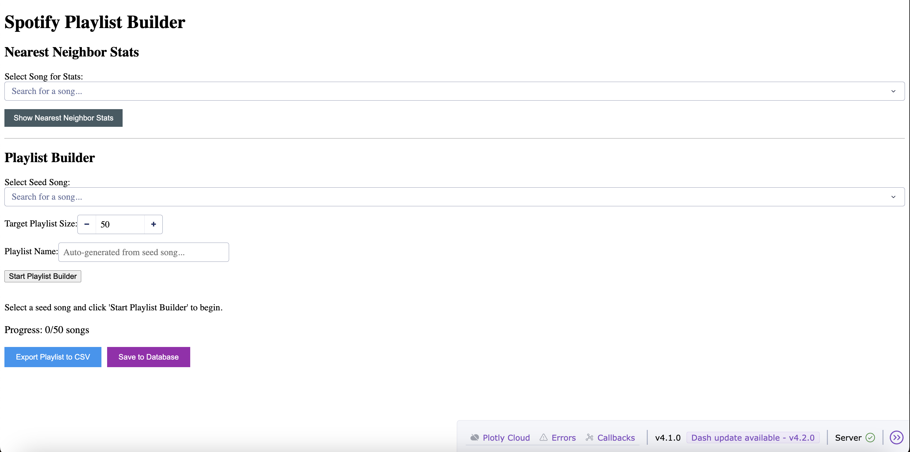
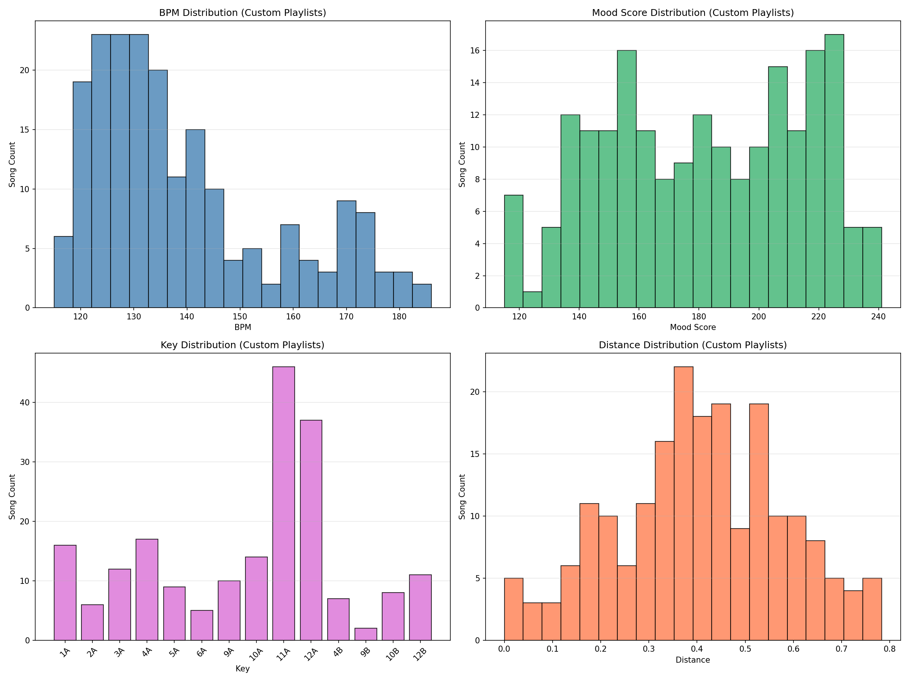
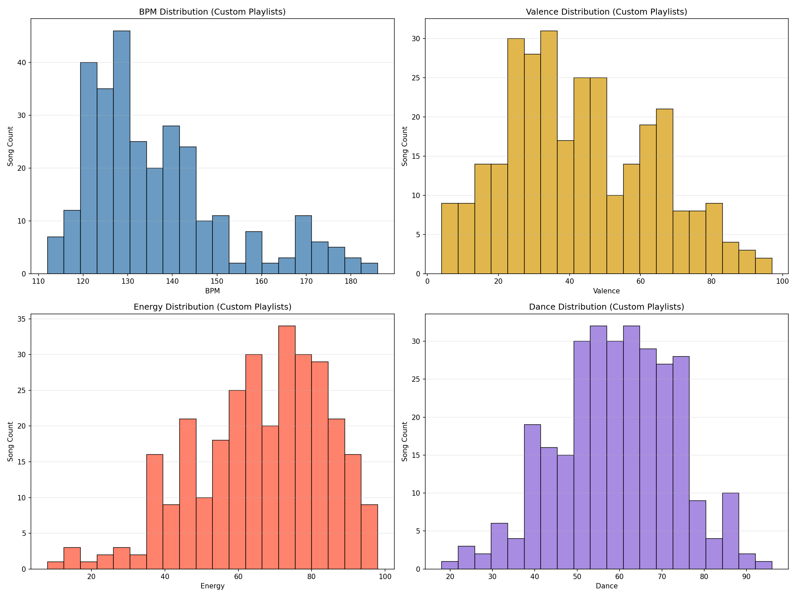

# spotify-music-library
A Spotify-powered song recommendation system using K-nearest neighbors on audio features, with clustering analysis to explore mood and sonic patterns across 5,300+ tracks.

## Overview

This project ingests 50 Spotify playlists into a SQLite database, deduplicates tracks across playlists, and analyzes audio features (BPM, valence, energy, acousticness, etc.) across 5,300+ songs. Three analysis layers are built on top: K-means clustering to surface mood and sonic groupings across the library, K-nearest neighbors recommendation to find songs similar to a given seed track, and an interactive playlist builder that constructs custom playlists by walking through similarity-ranked candidates with accept/reject review. The goal is discovery without repetition: building new playlists that don't recycle the same tracks. 

**Stack:** Python, SQLite, pandas, scikit-learn, Plotly Dash, matplotlib/seaborn.

**Key design decisions:**
- Tracks deduplicated by composite Track_Key (artist + song) to handle 
  Spotify's multiple Track_IDs for the same song
- Valence weighted 1.5x in clustering to prioritize mood coherence — prevents 
  sad and happy songs from grouping by shared energy/tempo
- K-nearest neighbors (KNN) on audio features for song recommendations — finds 
  similar songs by Euclidean distance on standardized features (BPM, valence, 
  dance, energy, acoustic, loudness) with optional year filtering
- Interactive playlist builder pairs KNN recommendations with human-in-the-loop curation,
  with optional filtering against previously saved playlists to enforce non-repetition


## Project Structure

```
.
├── README.md
├── data/
│   ├── playlists/
│   └── harmonic_mixing_rules.csv
├── images/
├── requirements.txt
├── results/
├── spotify_music_library.db
└── src/
    ├── analysis/
    │   ├── dashboard.py
    │   ├── feature_analysis.py
    │   ├── knn_seed_songs.py
    │   ├── sample_queries.py
    │   └── visualize_distributions.py
    └── db/
        ├── create_artist_playlist_count.py
        ├── create_mixing_rules.py
        ├── create_playlists.py
        ├── create_song_playlist_count.py
        ├── create_tracks.py
        └── setup_database.py
```

## Database Setup

The `src/db/create_playlists.py` script ingests CSV files from 50 Spotify playlists into a SQLite database. The script:

- Reads all CSV files from the `data/` folder
- Extracts playlist number and name from filenames (format: `number_name.csv`)
- Adds metadata columns: `playlist_number`, `playlist_name`, `Album_Year`, and `Track_Key`
- Renames columns for SQL compatibility: `#` → `Song_Number`, `Spotify Track Id` → `Track_ID`
- Appends all data to a `playlists` table in `spotify_music_library.db`

### Setup Commands

```bash
# Create virtual environment
python -m venv .venv
source .venv/bin/activate

# Install dependencies
pip install -r requirements.txt
```

### Database Setup

Run the `src/db/setup_database.py` script to run all database setup steps in sequence:

```bash
python src/db/setup_database.py
```

This will:
1. Create the playlists table from CSV files
2. Deduplicate tracks and create the tracks table
3. Create the song playlist count table
4. Create the artist playlist count table

If you've added new CSV files to the `data/` folder, remove the existing database first:

```bash
rm spotify_music_library.db
```

**Output:**
```
=== Spotify Music Library Database Setup ===


--- Create playlists table from CSV files ---
Running create_playlists.py...
Database created: spotify_music_library.db
Playlists table created successfully.
Number of playlists: 50
Row count: 9933
✓ create_playlists.py completed successfully

--- Deduplicate tracks and create tracks table ---
Running create_tracks.py...
Unique Track_IDs: 6027
Unique Track_Keys: 5473
Unique Artists: 2077
Removed: 554 duplicate tracks (same song, different Track_ID)
Tracks table created with unique tracks sorted by Artist, Song.
✓ create_tracks.py completed successfully

--- Create song playlist count table ---
Running create_song_playlist_count.py...
Total unique songs: 5473
Songs in multiple playlists: 2324
Maximum playlists per song: 11
Song playlist count table created successfully.
✓ create_song_playlist_count.py completed successfully

--- Create artist playlist count table ---
Running create_artist_playlist_count.py...
Total unique artists: 2077
Artists in multiple playlists: 1084
Maximum playlists per artist: 20
Artist playlist count table created successfully.
✓ create_artist_playlist_count.py completed successfully

--- Create harmonic mixing rules table ---
Running create_mixing_rules.py...
Mixing rules table created successfully.
Total transitions loaded: 192
✓ create_mixing_rules.py completed successfully

=== Database Setup Complete ===
All database tables have been created successfully.
```

### Sample Queries

You can run all sample queries at once using the `src/analysis/sample_queries.py` script:

```bash
python src/analysis/sample_queries.py
```

**Get number of unique playlists:**
50

**Get number of unique artists:**
2077

**Get number of unique songs:**
5473

**Get top five artists with song count:**
```
Backstreet Boys|107
OneRepublic|88
Maroon 5|71
Matt Maeson|64
The Fray|58
```

**Get top 5 songs by playlist count:**
```
Get top 5 songs by playlist count:
Kenny Loggins - Danger Zone - From  Top Gun  Original Soundtrack: 11 playlists
The Fray - Singing Low: 10 playlists
Arctic Monkeys - Do I Wanna Know: 9 playlists
Shania Twain - That Don't Impress Me Much: 8 playlists
Blue Foundation - Eyes on Fire: 8 playlists
```

**Get top 5 artists by playlist count:**
```
Rainbow Kitten Surprise: 20 playlists
OneRepublic: 18 playlists
Matt Maeson: 18 playlists
Britney Spears: 18 playlists
The Fray: 16 playlists
```

**Get songs from playlist 01:**
```
1|Temporary Love|The Brinks|2015
2|Basic Instinct|The Acid|2014
3|Stressed Out|Twenty One Pilots|2015
4|Genghis Khan|Miike Snow|2015
5|Carl Sagan|Night Moves|2016
6|Ophelia|The Lumineers|2016
7|Nobody Dies|Thao & The Get Down Stay Down|2015
8|Little Numbers - Acoustic Version|BOY|2013
9|I'm a Mess|Ed Sheeran|2014
10|Devil Devil|MILCK|2016
11|Cliff|Låpsley|2016
12|Middle|DJ Snake,Bipolar Sunshine|2015
```

**Get harmonic mixing transitions for key 1A:**
```
12A (minus_1_mix)
12B (diagonal_mix)
1A (perfect_mix)
1B (scale_change)
2A (plus_1_mix)
3A (energy_boost)
4B (mood_shifter)
8A (jaws_mix)
```   

## Analysis

### Data Distribution

The `src/analysis/visualize_distributions.py` script generates charts to analyze the library's composition and identify patterns:

- **Artist Distribution:** 47.8% of artists appear in only one playlist, suggesting a wide artist range across the library rather than repeated reuse.
- **Track Distribution:** 57.5% of songs are unique to a single playlist, indicating that playlists tend to function as distinct collections rather than overlapping selections.
- **Playlist Composition:**
  - Artist density: 42% of playlists contain fewer than 50 unique artists, while 6% of playlists contain more than 200 unique artists.
  - Track volume: 14% of playlists have 50 or fewer songs and 8% of playlists exceed 500 tracks; the majority vary in size, between 51-500 songs.

**Run script:**
```bash
python src/analysis/visualize_distributions.py
```

**Output:**


- Prints statistics for artist and song playlist count distributions

### Feature Analysis

The `src/analysis/feature_analysis.py` script analyzes audio features from the tracks table and generates visualizations:

- **Feature Statistics**: Displays mean, standard deviation, min, max, and quartiles for the selected features (BPM, Valence, Dance, Energy).
- **Feature Distributions**: Plots histogram + KDE for each feature showing the distribution and summary statistics.
- **Correlation Matrix**: Shows the correlation between audio features as a heatmap to identify relationships.

**Run script:**
```bash
python src/analysis/feature_analysis.py
```

**Output:**


**Clustering Methodology:**

The script performs K-means clustering on audio features with the following approach:

- **Feature Standardization**: All features are standardized using StandardScaler to ensure equal contribution to the distance metric. The four features (`BPM`, `Valence`, `Dance`, `Energy`) are weighted equally.
- **Elbow Method**: The optimal number of clusters is determined using the elbow method, which plots inertia (within-cluster sum of squares) against the number of clusters. The elbow point is detected by finding the point with maximum distance from the line connecting the first and last points on the curve.
- **Cluster Selection**: The algorithm tests cluster counts from 3 to 10. The elbow method detected 6 clusters as the optimal number.
- **Visualization**: Clusters are visualized using feature pairs (Valence vs Energy, Valence vs Dance, Dance vs Energy, Valence vs BPM) to show how songs group by mood and rhythm/tempo characteristics.

**Output:**


### K-Nearest Neighbors (KNN) Seed Songs

The `src/analysis/knn_seed_songs.py` script finds similar songs to a given seed song using K-nearest neighbors based on audio features. This is useful for discovering new music similar to a favorite track.

**Methodology:**

- **Core Features**: Uses `BPM`, `Valence`, `Dance`, and `Energy` from the `tracks` table.
- **Mood Score**: Computes `mood_score = Valence + Dance + Energy` for each song.
- **Harmonic Key Step**: Reads `data/harmonic_mixing_rules.csv` and converts Camelot compatibility into grouped numeric steps:
  - Group 1: `Perfect Mix`, `-1 Mix`, `+1 Mix`
  - Group 2: `Energy Boost`, `Scale Change`
  - Group 3: `Diagonal Mix`
  - Group 4: `Jaw's Mix`
  - Group 5: `Mood Shifter`
- **Distance Formula**: Standardizes and computes Euclidean distance on three variables: `BPM`, `mood_score`, and `key_step`.

**Run script:**
```bash
python src/analysis/knn_seed_songs.py --song "Song Name" --artist "Artist Name" [--num-songs N]
```

**Arguments:**
- `--song`: Song name (required if not using default)
- `--artist`: Artist name (required if not using default)
- `--num-songs`: Number of similar songs to find (optional, default: 10)

**Output fields:**
- `Distance` (overall KNN distance)
- `Features` (`BPM`, `Valence`, `Dance`, `Energy`, `Key`)
- `Mood Score (Valence+Dance+Energy)`

**Sample Command:**
```bash
python src/analysis/knn_seed_songs.py --song "Snap Out Of It" --artist "Arctic Monkeys" --num-songs 10
```

**Sample Output:**
```
10 songs most similar to 'Snap Out Of It' by 'Arctic Monkeys':

0. Snap Out Of It — Arctic Monkeys (2013) [ORIGINAL]
   Distance: 0.0000
   Features: BPM=130, Mood Score=224.0, Key Step=1
   Core Features: BPM=130, Valence=87, Energy=64, Dance=73, Key=4A

1. You're Not in on the Joke — Cobra Starship (2009)
   Distance: 0.0000
   Features: BPM=130, Mood Score=224.0, Key Step=1
   Core Features: BPM=130, Valence=85, Energy=77, Dance=62, Key=5A

2. Don't Phunk With My Heart — Black Eyed Peas (2005)
   Distance: 0.0417
   Features: BPM=131, Mood Score=223.0, Key Step=1
   Core Features: BPM=131, Valence=61, Energy=93, Dance=69, Key=4A

3. It's Not Right But It's Okay — Mr. Belt & Wezol (2024)
   Distance: 0.0702
   Features: BPM=128, Mood Score=224.0, Key Step=1
   Core Features: BPM=128, Valence=62, Energy=86, Dance=76, Key=4A

4. Handshake — Two Door Cinema Club (2012)
   Distance: 0.0761
   Features: BPM=131, Mood Score=221.0, Key Step=1
   Core Features: BPM=131, Valence=82, Energy=83, Dance=56, Key=5A

5. Kacey Talk — YoungBoy Never Broke Again (2020)
   Distance: 0.1146
   Features: BPM=127, Mood Score=226.0, Key Step=1
   Core Features: BPM=127, Valence=77, Energy=61, Dance=88, Key=3A

6. Fool's Gold — Aaron Carter (2018)
   Distance: 0.1351
   Features: BPM=130, Mood Score=218.0, Key Step=1
   Core Features: BPM=130, Valence=79, Energy=70, Dance=69, Key=4A

7. In the Ayer — Flo Rida,will.i.am (2008)
   Distance: 0.1422
   Features: BPM=126, Mood Score=223.0, Key Step=1
   Core Features: BPM=126, Valence=65, Energy=75, Dance=83, Key=4A

8. Kiss — Presley Regier (2025)
   Distance: 0.1756
   Features: BPM=125, Mood Score=224.0, Key Step=1
   Core Features: BPM=125, Valence=76, Energy=57, Dance=91, Key=4A

9. Beautiful — Akon,Colby O'Donis,Kardinal Offishall (2008)
   Distance: 0.1802
   Features: BPM=130, Mood Score=232.0, Key Step=1
   Core Features: BPM=130, Valence=63, Energy=95, Dance=74, Key=5A

10. I Like It — Enrique Iglesias,Pitbull (2010)
   Distance: 0.1835
   Features: BPM=129, Mood Score=232.0, Key Step=1
   Core Features: BPM=129, Valence=73, Energy=94, Dance=65, Key=3A
```

## Interactive Dashboard

The `src/analysis/dashboard.py` script creates an interactive Plotly Dash dashboard for finding similar songs using K-nearest neighbors:

- **Song Search**: Searchable dropdown with ~5,300 songs sorted by title (format: "Song - Artist")
- **Year Range Filter**: Filter results to songs within a specified number of years from the seed song's release year
- **Number of Songs**: Configure how many similar songs to return (default: 10)
- **Results Display**: Shows the seed song and similar songs with distance, `Features` (`BPM`, `Mood Score`, `Key Step`) and `Core Features` (`BPM`, `Valence`, `Energy`, `Dance`, `Key`)

**Dashboard Screenshot:**



The dashboard will start locally at `http://127.0.0.1:8050/`

**Methodology:**

- Uses Euclidean distance on standardized `BPM`, `mood_score`, and `key_step`
- Computes `mood_score = Valence + Dance + Energy`
- Computes grouped `key_step` from `data/harmonic_mixing_rules.csv`:
  - Group 1: `Perfect Mix`, `-1 Mix`, `+1 Mix`
  - Group 2: `Energy Boost`, `Scale Change`
  - Group 3: `Diagonal Mix`
  - Group 4: `Jaw's Mix`
  - Group 5: `Mood Shifter`

**Run script:**
```bash
python src/analysis/dashboard.py
```

### Playlist Builder

The dashboard includes an interactive playlist builder that lets you create a custom playlist by accepting or rejecting songs one by one based on similarity to a seed song.

**Features:**

- **Song Search**: Searchable dropdown with ~5,300 songs sorted by title (format: "Song - Artist")
- **Session-only CSV Upload (above seed selection)**: Upload songs directly in Playlist Builder before choosing the seed song.
- **Uploaded Songs as Seed + Candidates**: Uploaded songs are added to the seed-song dropdown and the candidate pool used for KNN distance ranking.
- **Uploaded Song Labeling**: Uploaded tracks are marked as `[Uploaded CSV]` in the UI.
- **Target Playlist Size**: Set the total number of songs for your playlist (including the seed song, default: 50)
- **Interactive Review**: Review songs one by one, starting with the most similar
- **Accept/Reject**: Accept songs to add to your playlist, or reject to skip
- **Progress Tracking**: Real-time progress display (e.g., "1/50" when seed selected, "25/50" after accepting 24 songs)
- **Export**: Export your completed playlist to CSV with Track_Number, Track_Key, Track_ID, Song, Artist, Album, Year, `Distance`, `BPM`, `Valence`, `Energy`, `Dance`, `Key`, `Mood_Score`, and `Key_Step` (including session-uploaded songs selected in the playlist)

**Methodology:**

- Uses the same K-nearest neighbors algorithm as the KNN Seed Songs feature
- Session-only uploaded CSV rows are merged into the in-memory candidate pool (not persisted to the `tracks` table)
- Songs are offered in order of similarity (most similar first)
- Seed song counts as #1 in the playlist
- Export includes Spotify Track_ID for easy import to Spotify

**How to Use:**

1. (Optional) Upload a CSV in Playlist Builder using `Upload Playlist CSV`
2. Select a seed song from the dropdown (database or uploaded songs)
3. Set target playlist size
4. Click "Start Playlist Builder"
5. Review each song offered and click "Accept" or "Reject"
6. Continue until you reach your target size
7. Click "Export Playlist to CSV" to download your playlist as a CSV file

**CSV requirements (session upload):**

- Required columns: `Song`, `Artist`, `BPM`, `Valence`, `Dance`, `Energy`
- Also required: either `Camelot` or `Key`
- Optional columns (if present): `Track_ID`, `Album`, `Year`, `Popularity`

### Songs by Key

The dashboard also includes a **Songs by Key** section so you can quickly examine songs that share the same Camelot key.

- Select a key to view matching songs from the library.
- Use it to check harmonic compatibility when building playlists.

### Visualize Custom Playlist Distributions

Use `src/analysis/visualize_custom_playlists.py` to analyze exported custom playlists from the `results/` folder.

This script reads all playlist CSVs in `results/` and generates:

- Summary stats (total playlists, total songs, songs per playlist)
- Average playlist-level features (`bpm`, `valence`, `energy`, `dance`, `mood_score`, `distance`)
- Distribution charts for `BPM`, `Mood Score`, `Key`, and `Distance`
- Core feature distribution charts for `BPM`, `Valence`, `Energy`, and `Dance`

**Run command:**

```bash
python src/analysis/visualize_custom_playlists.py
```

**Output charts:**

- `images/custom_playlist_distributions.png`
- `images/custom_playlist_core_feature_distributions.png`




